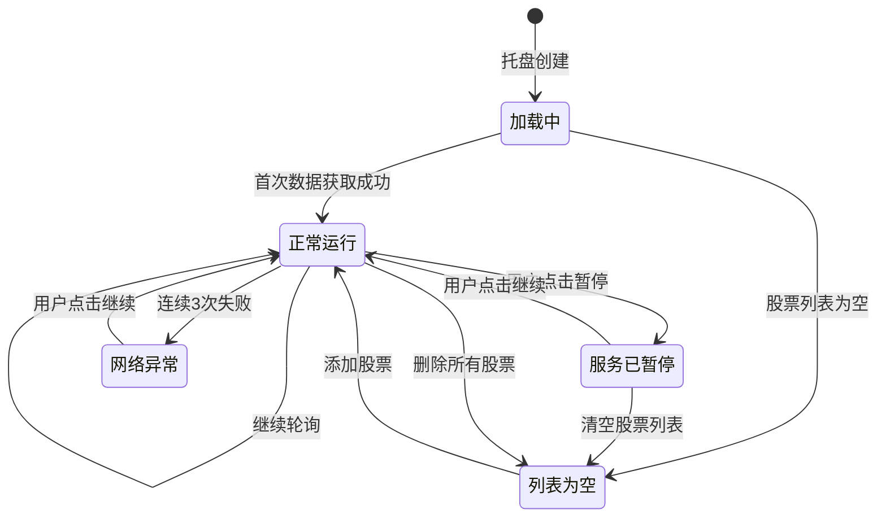

# Stock Watcher 产品文档

## 1. 产品概述

### 1.1 产品简介

Stock Watcher 是一款基于 Electron + React + TypeScript 构建的轻量级股票盯盘桌面应用，以系统托盘为核心交互界面，提供透明的浮窗面板进行股票管理。

### 1.2 核心特性

| 特性 | 说明 |
|------|------|
| 系统托盘常驻 | 应用启动后隐藏 dock 图标（仅 macOS），仅在系统托盘运行 |
| 透明浮窗 | 可配置位置的置顶浮窗，显示股票管理面板 |
| 实时行情 | 通过新浪财经 API 获取股票数据 |
| 托盘展示 | 托盘标题实时滚动显示股票行情 |
| 智能暂停 | 支持手动暂停/继续，系统休眠时自动暂停 |

---

## 2. 技术架构

### 2.1 技术栈

| 层级 | 技术选型 |
|------|---------|
| 桌面框架 | Electron 30.x |
| 前端框架 | React 18.x |
| 开发语言 | TypeScript 5.x |
| 构建工具 | Vite 5.x + electron-builder |
| 状态存储 | electron-store |
| 编码处理 | iconv-lite (GBK → UTF-8) |
| HTTP 客户端 | Node.js http 模块 |

### 2.2 模块结构

```
electron/
├── main.ts              # 主进程入口
├── float-window.ts      # 浮窗管理模块
├── stock-api.ts         # 股票数据 API 模块
├── stock-formatter.ts   # 股票格式化模块
├── preload.ts           # 预加载脚本（暴露 IPC API）
├── types/
│   └── index.ts         # 类型定义
└── electron-env.d.ts    # Electron 环境类型声明

src/
├── App.tsx              # React 应用入口
├── App.css             # 样式文件
├── main.tsx            # React 渲染入口
├── index.css           # 全局样式
├── vite-env.d.ts       # Vite 环境类型声明
└── assets/            # 静态资源

public/                # Vite 公共资源目录
```

### 2.3 模块职责

| 模块 | 职责 |
|------|------|
| `main.ts` | 应用生命周期、托盘管理、IPC 通信、系统电源监控 |
| `float-window.ts` | 浮窗显示/隐藏、HTML 构建、位置/尺寸持久化 |
| `stock-api.ts` | 股票数据获取、股票代码验证 (新浪 API) |
| `stock-formatter.ts` | 行情文本格式化 (涨跌 emoji、显示字符串) |
| `preload.ts` | 通过 contextBridge 安全暴露 IPC 方法到渲染进程 |
| `types/index.ts` | 共享类型定义 (StoreSchema、StockData 等) |

### 2.4 Preload 模块安全性

preload.ts 使用 contextBridge 安全地暴露 IPC 方法：

```typescript
contextBridge.exposeInMainWorld('ipcRenderer', {
  invoke(...args) { return ipcRenderer.invoke(...args) },
  send(...args) { return ipcRenderer.send(...args) },
  on(...args) { return ipcRenderer.on(...args) },
  off(...args) { return ipcRenderer.off(...args) }
})
```

这种方式允许渲染进程通过 `window.ipcRenderer.invoke()` 调用主进程方法，同时保持 contextIsolation 的安全性。

---

## 3. 功能详解

### 3.1 系统托盘

#### 3.1.1 托盘菜单

| 菜单项 | 功能 | 互斥状态 |
|--------|------|----------|
| 显示浮层 | 打开股票管理浮窗 | 浮窗已显示时禁用 |
| 隐藏浮层 | 关闭股票管理浮窗 | 浮窗已隐藏时禁用 |
| 暂停 | 停止行情轮询 | 已暂停时禁用 |
| 继续 | 恢复行情轮询 | 未暂停时禁用 |
| 退出 | 退出应用程序 | - |

**菜单重建时机：**
- 调用 `pauseUpdates()`、`stopUpdates()`、`restartUpdates()` 后
- 浮窗显示/隐藏时

#### 3.1.2 托盘交互

- **左键点击**：弹出右键菜单
- **右键点击**：弹出右键菜单

#### 3.1.3 托盘标题状态

托盘标题会根据不同状态显示不同内容：

| 状态 | 标题示例 | 触发条件 |
|------|---------|----------|
| 加载中 | `▪ 股票分析 加载中...` | 托盘创建后、首次数据获取前 |
| 正常运行 | `📈 阿里巴巴 180.5 +2.3 (1.29%)` | 成功获取股票数据后 |
| 列表为空 | `▪ 股票分析` | 股票列表为空时 |
| 服务已暂停 | `▪ 服务已暂停` | 用户点击「暂停」后（保持最后一只股票） |
| 网络异常 | `▪ 网络异常` | 连续 3 次获取失败后 |

#### 3.1.4 托盘提示文本 (Tooltip)

| 状态 | 提示文本 |
|------|---------|
| 正常运行 | 当前股票行情文本（如 `📈 阿里巴巴 180.5 +2.3 (1.29%)`） |
| 服务已暂停 | `服务已暂停` |
| 网络异常 | `网络异常，请点击"继续"恢复` |

---

### 3.2 浮窗面板

#### 3.2.1 位置与尺寸

- **默认位置**：屏幕右下角 (x: screenWidth - 270, y: screenHeight - 320)
- **默认尺寸**：250 × 300 像素
- **持久化**：位置和尺寸保存到 electron-store，窗口移动/调整后自动保存

#### 3.2.2 窗口属性

| 属性 | 值 | 说明 |
|------|-----|------|
| frame | false | 无边框窗口 |
| transparent | false | 不透明背景 |
| alwaysOnTop | true | 置顶显示 |
| skipTaskbar | true | 不显示在任务栏 |
| resizable | true | 可调整尺寸 |
| minimizable | false | 不可最小化 |
| maximizable | false | 不可最大化 |
| backgroundColor | #1e1e1e | 窗口背景色 |

#### 3.2.3 拖拽区域

浮窗面板顶部区域（`.header`）为可拖拽区域，使用 `-webkit-app-region: drag` 实现。输入框、按钮等交互元素使用 `-webkit-app-region: no-drag` 排除拖拽。

#### 3.2.4 面板内容

```
┌─────────────────────────┐
│ [股票输入框] [添加按钮]  │  ← 可拖拽区域
│ 轮询间隔(秒): [__3__]   │
│ [状态提示]              │
├─────────────────────────┤
│ usBABA 阿里巴巴    [×] │
│ usAAPL 苹果        [×] │  ← 可滚动列表
│ ...                     │
├─────────────────────────┤
│      [保存按钮]         │
└─────────────────────────┘
```

---

### 3.3 股票管理

#### 3.3.1 添加股票

1. 在输入框输入股票代码 (如 `usBABA`)
2. 点击「添加」或按 **Enter 键**
3. 系统调用新浪 API 验证股票代码
4. 验证过程中「添加」按钮 **自动禁用**，防止重复提交
5. 显示状态提示：
   - "验证中..." → 验证中
   - "添加成功" → 验证成功
   - "股票不存在" / "网络错误" / "请求超时" → 验证失败
6. 验证成功 → 添加到列表并显示股票名称，输入框自动清空

#### 3.3.2 删除股票

1. 点击股票行右侧的删除按钮 (×)
2. 立即从本地列表移除
3. 页面重新渲染

#### 3.3.3 保存生效

1. 点击「保存」按钮
2. 通过 IPC 发送 `save-stocks` 事件
3. main.ts 更新 `stockList` 并持久化到 store
4. 重启轮询定时器
5. 浮窗自动关闭

---

### 3.4 行情轮询

#### 3.4.1 轮询机制

| 配置项 | 默认值 | 说明 |
|--------|--------|------|
| 轮询间隔 | 3000ms | 可在浮窗中配置，最小 1 秒 |
| 最大连续失败 | 3 次 | 超过后停止轮询 |
| 请求超时 | 5000ms | 单次请求超时 |

**轮询间隔输入约束：**

- HTML 输入框：`min="1" step="1"`（最小值 1 秒）
- 代码保护：`if (pollIntervalSec < 1) pollIntervalSec = 1;`

#### 3.4.2 连续失败处理

```
失败 1 次 → 继续
失败 2 次 → 继续
失败 3 次 → 停止轮询，显示"网络异常"
```

#### 3.4.3 股票轮换逻辑

当股票列表有多只股票时，使用 `currentStockIndex` 轮换显示：

```typescript
currentStockIndex = (currentStockIndex + 1) % stockList.length;
```

每次轮询后，索引递增并取模，实现循环显示。

#### 3.4.4 空列表处理

当股票列表为空时：
- 停止轮询定时器
- 重置 `currentStockIndex` 为 0
- 托盘标题显示 `▪ 股票分析`
- 不再发起 API 请求

#### 3.4.5 暂停与继续

**触发暂停的场景：**

- 用户点击菜单「暂停」
- 系统进入休眠 (suspend 事件)
- 屏幕锁定 (lock-screen 事件)
- 连续失败达到阈值

**触发继续的场景：**

- 用户点击菜单「继续」
- 系统从休眠唤醒 (resume 事件) + 股票列表非空
- 屏幕解锁 (unlock-screen 事件) + 股票列表非空
- 保存股票后重启轮询

---

### 3.5 电源管理

| 系统事件 | 处理动作 |
|----------|----------|
| suspend | 暂停轮询 |
| resume | 恢复轮询 (如有股票) |
| lock-screen | 暂停轮询 |
| unlock-screen | 恢复轮询 (如有股票) |

---

## 4. 数据结构

### 4.1 股票数据

```typescript
interface StockItem {
  code: string;  // 股票代码，如 "usBABA"
  name: string;  // 股票名称，如 "阿里巴巴"
}

interface StockData {
  name: string;           // 股票名称
  code: string;           // 股票代码
  price: number;         // 当前价格
  change: number;         // 涨跌值
  changePercent: number;  // 涨跌幅 (%)
  currency: string;       // 货币单位，如 "USD"
}
```

### 4.2 配置存储

```typescript
interface StoreSchema {
  floatWindowBounds: {
    x: number;      // 窗口 X 坐标
    y: number;      // 窗口 Y 坐标
    width: number;  // 窗口宽度
    height: number; // 窗口高度
  };
  stockList: StockItem[];  // 股票列表
  pollIntervalMs: number;   // 轮询间隔 (毫秒)
}
```

**默认值：**

```typescript
{
  floatWindowBounds: { x: -1, y: -1, width: 250, height: 300 },
  stockList: [
    { code: 'usBABA', name: '阿里巴巴' },
    { code: 'usAAPL', name: '苹果' }
  ],
  pollIntervalMs: 3000
}
```

---

## 5. API 接口

### 5.1 新浪财经 API

**数据接口：** `http://qt.gtimg.cn/q={stockCode}`

**返回格式：** GBK 编码的文本数据

**解析字段：**

| 字段索引 | 含义 |
|----------|------|
| 1 | 股票名称 |
| 2 | 股票代码 |
| 3 | 当前价格 |
| 31 | 涨跌值 |
| 32 | 涨跌幅 (%) |
| 35 | 货币单位 |

### 5.2 IPC 通信

| IPC 通道 | 方向 | 用途 | 返回值 |
|----------|------|------|--------|
| `verify-stock` | handle (异步) | 验证股票代码，返回股票名称 | `{ success: boolean; name?: string; error?: string }` |
| `save-stocks` | send (单向) | 保存股票列表和轮询间隔 | 无返回值 |

**verify-stock 返回值示例：**

```typescript
// 成功
{ success: true, name: "阿里巴巴" }

// 失败
{ success: false, error: "股票不存在" }
{ success: false, error: "网络错误" }
{ success: false, error: "请求超时" }
```

---

## 6. 用户交互流程

### 6.1 首次启动

```
应用启动
  → app.dock.hide() (macOS 隐藏 dock)
  → app.whenReady()
  → 创建系统托盘
  → 托盘标题显示"▪ 股票分析 加载中..."
  → 从 store 加载股票列表
  → 启动轮询定时器（如有股票）
  → 托盘标题轮换显示股票行情
```

### 6.2 修改股票配置

```
点击托盘 → 显示浮层
  → 添加/删除股票
  → 修改轮询间隔
  → 点击保存
    → 浮窗关闭
    → 配置持久化
    → 轮询重启
```

### 6.3 网络异常

```
连续 3 次获取失败
  → 停止轮询
  → 托盘标题显示"▪ 网络异常"
  → 托盘提示显示"网络异常，请点击"继续"恢复"
  → 提示用户点击"继续"恢复
```

---

## 7. 菜单互斥机制

### 7.1 实现原理

通过回调函数实现状态变化时的菜单重建：

```typescript
// 状态变量
let onPauseStateChange: (() => void) | null = null;
let onVisibilityChange: (() => void) | null = null;

// 状态变化时调用
function pauseUpdates() {
  // ... 暂停逻辑
  onPauseStateChange?.();  // 重建菜单
}

// 菜单根据状态设置 enabled
function rebuildTrayMenu() {
  const paused = isUpdatesPaused();
  const floatVisible = isFloatWindowVisible();
  // "暂停" enabled = !paused
  // "继续" enabled = paused
}
```

### 7.2 浮窗菜单状态

| 浮窗状态 | 显示浮层 | 隐藏浮层 |
|----------|----------|----------|
| 隐藏 | ✅ 可用 | ❌ 禁用 |
| 显示 | ❌ 禁用 | ✅ 可用 |

### 7.3 轮询菜单状态

| 轮询状态 | 暂停 | 继续 |
|----------|------|------|
| 运行中 | ✅ 可用 | ❌ 禁用 |
| 已暂停 | ❌ 禁用 | ✅ 可用 |

---

## 8. 应用生命周期

### 8.1 关键事件

| 事件 | 处理逻辑 |
|------|----------|
| `ready` | 创建托盘、初始化浮窗、设置电源监控 |
| `window-all-closed` | `e.preventDefault()` 阻止默认退出行为 |
| `before-quit` | 停止轮询、关闭浮窗、清理资源 |
| `activate` | 如托盘不存在则重新创建 |

### 8.2 退出流程

```
用户点击"退出"菜单
  → app.quit()
  → 触发 before-quit 事件
    → stopUpdates() - 停止轮询
    → hideFloatWindow() - 关闭浮窗
  → 应用退出
```

---

## 9. 构建与部署

### 9.1 构建配置 (electron-builder.json5)

| 配置项 | 值 |
|--------|-----|
| appId | com.stockwatcher.app |
| productName | Stock Watcher |
| application root | dist-electron/main.js |
| macOS target | dmg |
| Windows target | nsis |
| Linux target | AppImage |
| 图标目录 | images/icon |

### 9.2 构建输出

```
release/
└── 1.0.0/
    ├── Stock Watcher-1.0.0.dmg          # macOS 安装包
    ├── Stock-Watcher-1.0.0-Setup.exe   # Windows 安装包
    └── Stock-Watcher-1.0.0.AppImage    # Linux 安装包
```

### 9.3 图标路径处理

```typescript
const iconPath = app.getAppPath().replace(/\\/g, '/') + '/public/electron-vite.svg';
```

- 兼容 Windows 路径分隔符（反斜杠转正斜杠）
- 从应用根目录的 `public` 文件夹加载图标

---

## 10. 文件清单

| 文件路径 | 说明 | 行数 |
|----------|------|------|
| `electron/main.ts` | 主进程入口，托盘管理、IPC 通信 | 267 行 |
| `electron/float-window.ts` | 浮窗管理模块，内嵌 HTML 界面 | 243 行 |
| `electron/stock-api.ts` | 股票 API 模块，数据获取与验证 | 102 行 |
| `electron/stock-formatter.ts` | 格式化模块，涨跌 emoji、显示字符串 | 24 行 |
| `electron/preload.ts` | 预加载脚本，暴露 IPC API | 25 行 |
| `electron/types/index.ts` | 类型定义 | 27 行 |
| `electron/electron-env.d.ts` | Electron 环境类型声明 | 28 行 |
| `src/App.tsx` | React 应用入口 | ~50 行 |
| `src/main.tsx` | React 渲染入口 | ~20 行 |
| `vite.config.ts` | Vite 配置文件 | ~40 行 |
| `package.json` | 项目配置与依赖 | 39 行 |
| `electron-builder.json5` | Electron Builder 配置 | 36 行 |

---

## 11. 使用说明

### 11.1 安装依赖

```bash
yarn install
```

### 11.2 开发模式

```bash
yarn dev
```

启动 Vite 开发服务器 (默认端口 5173) 和 Electron 应用。

### 11.3 构建应用

```bash
yarn build
```

构建流程：TypeScript 编译 → Vite 构建 → Electron Builder 打包。

### 11.4 配置 lint

```bash
yarn lint
```

---

## 12. 附录

### 12.1 FloatWindowStoreSchema

float-window.ts 模块使用独立的类型定义：

```typescript
interface FloatWindowStoreSchema {
  floatWindowBounds: FloatWindowBounds;
  stockList: Array<{ code: string; name: string }>;
  pollIntervalMs: number;
}
```

与 main.ts 中的 `StoreSchema` 本质相同，但作用域限于浮窗模块。

### 12.2 托盘状态转换图



### 12.3 依赖说明

| 依赖 | 用途 | 备注 |
|------|------|------|
| canvas | 画布操作 | 已安装但未使用 |
| electron-store | 配置持久化 | 核心依赖 |
| iconv-lite | 编码转换 | 用于解析 GBK 响应 |
| react | UI 框架 | 浮窗使用内嵌 HTML 方案 |
